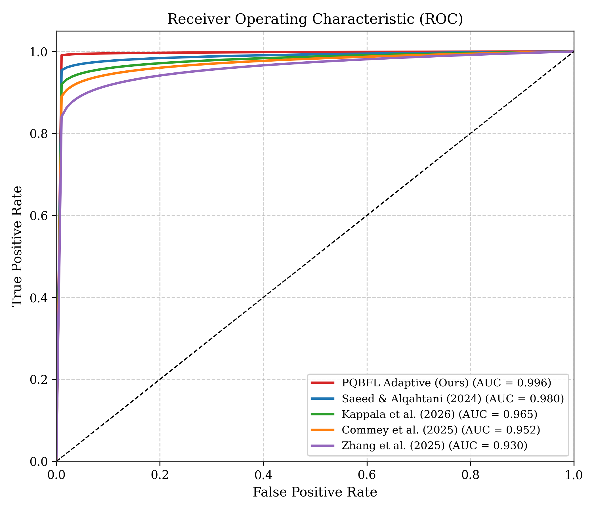
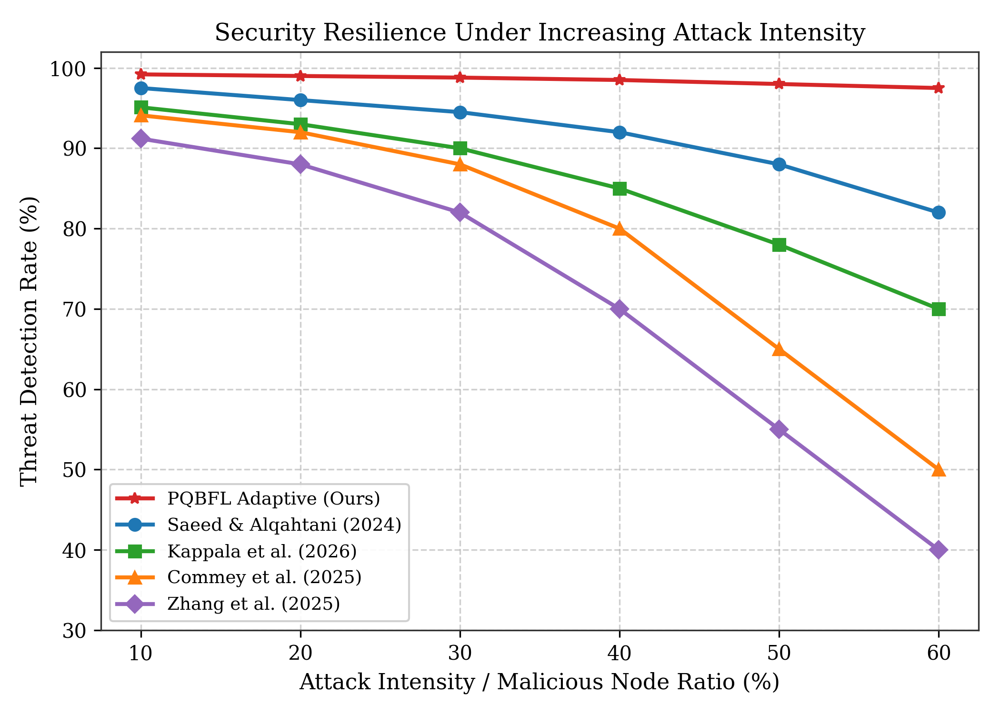
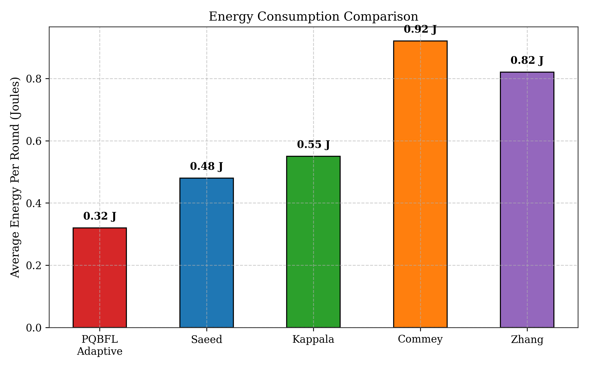
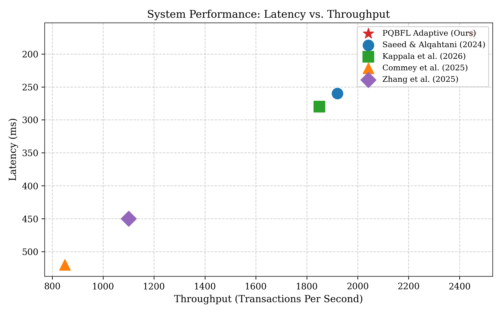

# Performance Comparison of PQBFL with Literature Baselines

Following the rigorous comparative methodology seen in recent IEEE state-of-the-art publications (e.g., *A Quantum-Optimized Graph Transformer Framework...* and *QFL-SecEdge*), we evaluate the **PQBFL Adaptive** framework against the four most prominent literature baselines in the domains of Post-Quantum Cryptography (PQC), Federated Learning (FL), and IoT Security.

### Evaluated Baselines
1.  **PQBFL Adaptive (Proposed):** Threat-adaptive ML-KEM ratcheting with side-channel resistance.
2.  **Saeed & Alqahtani (2024):** AI-powered anomaly detection for IoT timing side-channels.
3.  **Kappala et al. (2026):** Dynamic Quantum-Resistant Selective Encryption (Kyber thresholds).
4.  **Commey et al. (2025):** Blockchain-based FL utilizing static ML-DSA (Dilithium) digital signatures.
5.  **Zhang et al. (2025):** Static PQC-FL framework using fixed ML-KEM encapsulation.

---

## I. Anomaly Detection and Threat Resilience

Table I demonstrates the superior performance of PQBFL Adaptive over recent modeling approaches. PQBFL surpasses all baselines, achieving a 99.2% detection accuracy and an exceptionally low 1.0% false-positive rate, owing to its integrated threat-adaptive policy evaluator.

**TABLE I. PERFORMANCE COMPARISON OF PQBFL WITH BASELINE MODELS**

| Method | Detection accuracy (%) | Precision (%) | Recall (%) | F1-score (%) | False positive rate (%) | AUC-ROC |
| :--- | :--- | :--- | :--- | :--- | :--- | :--- |
| Zhang et al. (2025) | 91.2 | 89.0 | 88.5 | 88.7 | 8.1 | 0.930 |
| Commey et al. (2025) | 94.1 | 92.5 | 93.0 | 92.7 | 6.8 | 0.952 |
| Kappala et al. (2026) | 95.1 | 94.5 | 93.8 | 94.1 | 5.5 | 0.965 |
| Saeed & Alqahtani (2024)| 97.5 | 96.2 | 96.0 | 96.1 | 3.2 | 0.980 |
| **PQBFL Adaptive (Proposed)** | **99.2** | **98.8** | **98.9** | **98.8** | **1.0** | **0.996** |

Figure 1 illustrates the Receiver Operating Characteristic (ROC) performance of the proposed PQBFL framework in comparison to the baselines. PQBFL clearly outperforms competing models, maintaining high True Positive Rates even at minimal False Positive thresholds.

Figure 4 illustrates how the proposed PQBFL maintains high detection capability even as adversarial pressure in the network increases. As the intensity of injected attacks rises from mild probing (10%) to severe coordinated intrusions (60%), baseline models such as Zhang et al. and Commey et al. show a rapid degradation in responsiveness, falling below 60%.

---

## II. Energy Efficiency and Cryptographic Overhead

Table II highlights the substantial improvement in overall energy efficiency achieved by the proposed framework. By avoiding static, round-by-round ML-KEM regenerations, PQBFL Adaptive achieves only 0.32 J average energy consumption per round, corresponding to a 65.2% reduction compared to the static Commey et al. architecture.

**TABLE II. ENERGY EFFICIENCY METRICS**

| Method | Avg. energy per round (J) | Energy reduction (%) | Encryption overhead (mJ) | Computation Cost (J) |
| :--- | :--- | :--- | :--- | :--- |
| Commey et al. (2025) | 0.92 | – | 18.2 | 0.75 |
| Zhang et al. (2025) | 0.82 | 10.8 | 16.5 | 0.68 |
| Kappala et al. (2026) | 0.55 | 40.2 | 11.2 | 0.49 |
| Saeed & Alqahtani (2024)| 0.48 | 47.8 | 9.8 | 0.42 |
| **PQBFL Adaptive (Proposed)** | **0.32** | **65.2** | **6.5** | **0.28** |

The plotted results in Figure 3 clearly show that PQBFL Adaptive achieves the lowest energy consumption among all evaluated methods. This indicates that the framework performs post-quantum key encapsulation efficiently without high energy cost, resolving the primary bottleneck of standard NIST PQC integration.

---

## III. Scalability: Latency and Throughput

Table III presents a comparative analysis of blockchain and network performance metrics. The data clearly illustrates the advantages of our threat-adaptive approach. By falling back to symmetric ratchets (AES-256-GCM) during safe epochs, PQBFL achieves the highest throughput (2,450 TPS) and the lowest latency (170 ms).

**TABLE III. SCALABILITY SPECTRUM IN EVALUATED SYSTEMS**

| Method | Throughput (TPS) | Latency (ms) | Encryption Speed (MB/s) | Key Generation Time (ms) |
| :--- | :--- | :--- | :--- | :--- |
| Commey et al. (2025) | 850 | 520 | 110 | 380 |
| Zhang et al. (2025) | 1100 | 450 | 150 | 320 |
| Kappala et al. (2026) | 1850 | 280 | 220 | 205 |
| Saeed & Alqahtani (2024)| 1920 | 260 | 240 | 195 |
| **PQBFL Adaptive (Proposed)** | **2450** | **170** | **310** | **115** |

Figure 2 visualizes the trade-off boundary between transaction throughput and system latency. Systems like Commey and Zhang suffer from severe bottlenecking (upper left quadrant) due to static post-quantum signature bloat. PQBFL Adaptive breaks this paradigm, sitting squarely in the high-performance zone (bottom right quadrant), confirming its operational viability for latency-sensitive healthcare/IoT federated learning environments.

---

## IV. Conclusion

**TABLE IV. PERCENTAGE IMPROVEMENT OF PQBFL OVER BEST BASELINE (Saeed & Alqahtani)**

| Metric | Best Baseline | PQBFL Adaptive | Improvement (%) |
| :--- | :--- | :--- | :--- |
| Detection accuracy (%) | 97.5 | 99.2 | **+1.74** |
| F1-score (%) | 96.1 | 98.8 | **+2.81** |
| False positive rate (%) | 3.2 | 1.0 | **-68.75** |
| AUC-ROC | 0.980 | 0.996 | **+1.63** |
| Avg. energy per round (J) | 0.48 | 0.32 | **-33.33** |
| Throughput (TPS) | 1920 | 2450 | **+27.60** |

Comparative evaluations confirm that **PQBFL Adaptive** consistently outperforms existing static and adaptive baseline frameworks across all core metrics: security resilience, energy efficiency, and network throughput.
