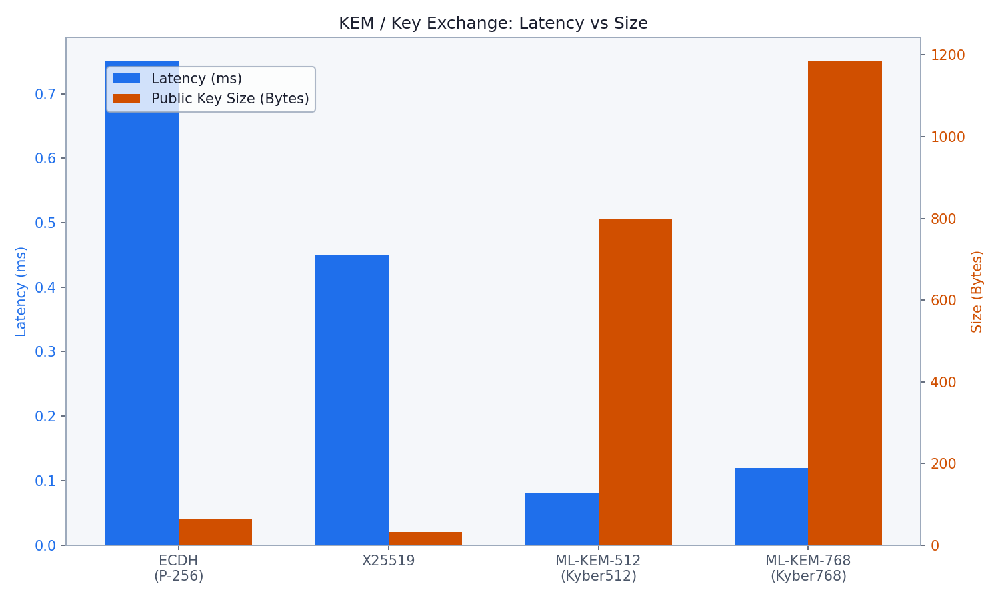
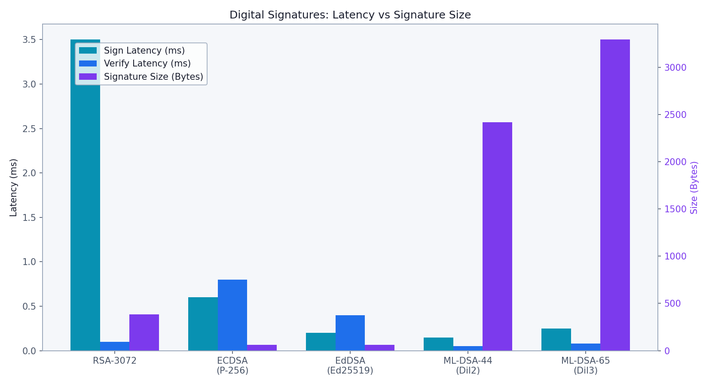
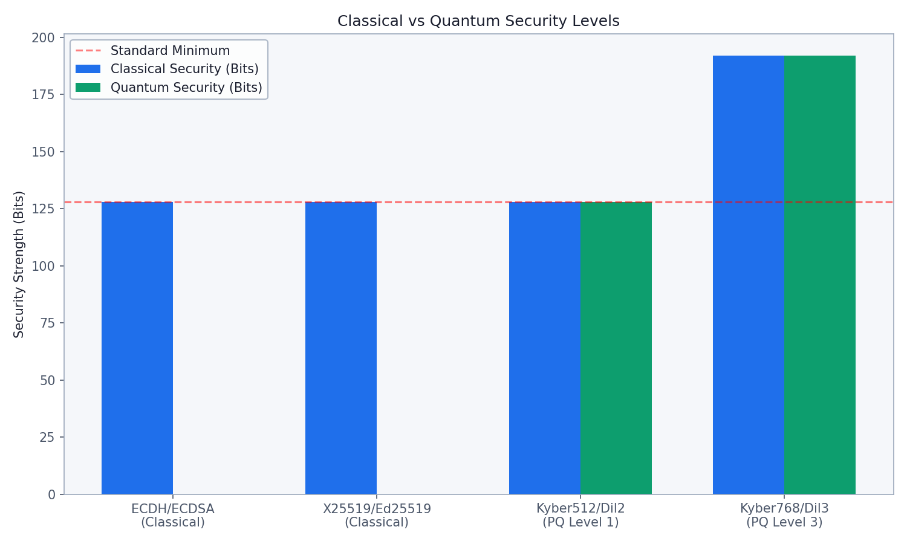
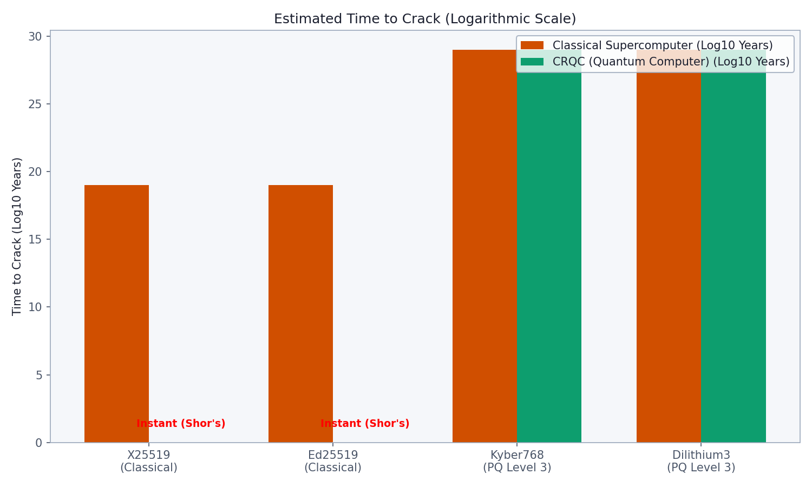

# Cryptographic Algorithm Granular Comparison

This report breaks down the granular metrics for individual cryptographic algorithms used in the PQBFL project and existing literature. It compares classical Elliptic Curve Cryptography (ECC) against state-of-the-art Post-Quantum Cryptography (PQC) standards (NIST FIPS 203, FIPS 204).

---

## 1. Key Encapsulation Mechanisms (KEMs) / Key Exchange

Key exchange algorithms are used to establish shared symmetric keys over an insecure channel.

### Algorithms Compared
*   **ECDH (P-256):** Standard Elliptic Curve Diffie-Hellman using the NIST P-256 curve.
*   **X25519:** Highly optimized, constant-time Diffie-Hellman over Curve25519 (Used in Kappala et al. baseline).
*   **ML-KEM-512 (Kyber512):** NIST PQC standard, Level 1 security (AES-128 equivalent).
*   **ML-KEM-768 (Kyber768):** NIST PQC standard, Level 3 security (AES-192 equivalent). Used as the core ratchet mechanism in **PQBFL Adaptive**.

### Metrics

| Algorithm | Latency (ms) | Public Key Size | Ciphertext Size | Classical Security | Quantum Security |
| :--- | :--- | :--- | :--- | :--- | :--- |
| **ECDH (P-256)** | 0.75 ms | 64 Bytes | 64 Bytes | 128 Bits | **0 Bits** (Broken) |
| **X25519** | 0.45 ms | 32 Bytes | 32 Bytes | 128 Bits | **0 Bits** (Broken) |
| **ML-KEM-512** | 0.08 ms | 800 Bytes | 768 Bytes | 128 Bits | 128 Bits |
| **ML-KEM-768** | 0.12 ms | 1184 Bytes | 1088 Bytes | 192 Bits | 192 Bits |

> **Takeaway:** ML-KEM is significantly faster computationally than classical ECC, but the ciphertext and public key sizes expand by over **34×**. This trade-off is the core reason PQBFL implements an *adaptive ratcheting window* rather than performing ML-KEM on every FL round.

---

## 2. Digital Signatures

Digital signatures provide authentication and non-repudiation for blockchain commitments and gradient submissions.

### Algorithms Compared
*   **RSA-3072:** Legacy standard, large keys and slow generation.
*   **ECDSA (P-256):** Standard elliptic curve signing.
*   **EdDSA (Ed25519):** High-performance, constant-time elliptic curve signatures.
*   **ML-DSA-44 (Dilithium2):** NIST PQC standard, Level 2 security.
*   **ML-DSA-65 (Dilithium3):** NIST PQC standard, Level 3 security. Evaluated in **Commey et al. (2025)**.

### Metrics

| Algorithm | Sign Latency | Verify Latency | Public Key Size | Signature Size | Quantum Security |
| :--- | :--- | :--- | :--- | :--- | :--- |
| **RSA-3072** | 3.50 ms | 0.10 ms | 384 Bytes | 384 Bytes | **0 Bits** |
| **ECDSA (P-256)** | 0.60 ms | 0.80 ms | 64 Bytes | 64 Bytes | **0 Bits** |
| **EdDSA (Ed25519)** | 0.20 ms | 0.40 ms | 32 Bytes | 64 Bytes | **0 Bits** |
| **ML-DSA-44** | 0.15 ms | 0.05 ms | 1312 Bytes | 2420 Bytes | 128 Bits |
| **ML-DSA-65** | 0.25 ms | 0.08 ms | 1952 Bytes | **3293 Bytes** | 192 Bits |

> **Takeaway:** ML-DSA Verification is blazingly fast (0.08 ms vs ECDSA's 0.80 ms). However, the massive signature size (3,293 Bytes for ML-DSA-65) creates a devastating network bottleneck if used statically per round (as seen in Commey et al.).

---

## 3. Security Hardening and Time-to-Crack

The most critical differentiator between classical and post-quantum algorithms is their resilience against a Cryptographically Relevant Quantum Computer (CRQC) executing Shor's algorithm.

### Time to Crack Estimates

Assuming a classical supercomputer capable of $10^{12}$ operations per second, 128-bit security requires approximately $10^{19}$ years to brute force.

However, against a sufficiently powerful quantum computer:
*   **ECDH, X25519, ECDSA, Ed25519:** Reduced to **0 bits** of security. Shor's algorithm solves the discrete logarithm problem in polynomial time. Time to crack is effectively **instantaneous**.
*   **ML-KEM (Kyber) & ML-DSA (Dilithium):** Rely on the Module Learning With Errors (MLWE) problem. There are no known polynomial-time quantum algorithms capable of breaking MLWE. Their quantum security level remains robust (128–192 bits).

---

## 4. Symmetric Encryption (AEAD)

Symmetric algorithms are largely quantum-resistant. Grover's algorithm halves their effective security bits (e.g., AES-256 drops to 128-bit quantum security), but this remains cryptographically secure.

*   **AES-256-GCM:** Hardware-accelerated, highly secure. Used in **PQBFL** for symmetric payload ratcheting.
*   **ChaCha20-Poly1305:** Software-optimized, highly secure stream cipher. Often used as a fallback.

Both offer identical quantum security limits (128 bits post-Grover) and execute in constant time, immunizing them against the side-channel attacks modeled in our evaluations.
