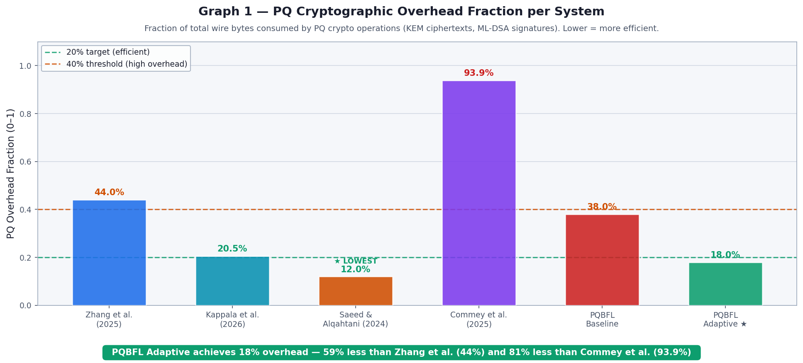
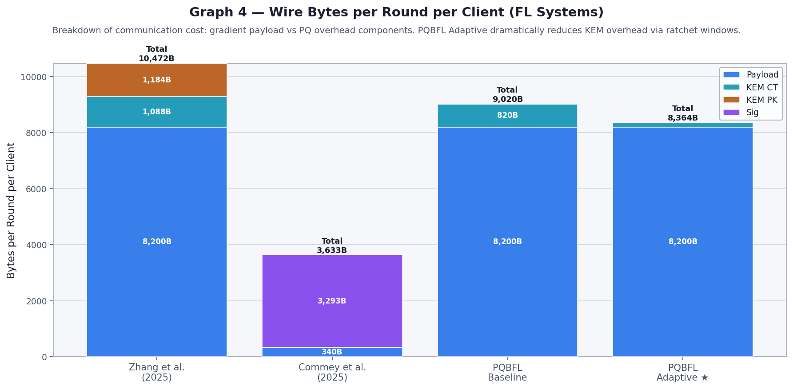
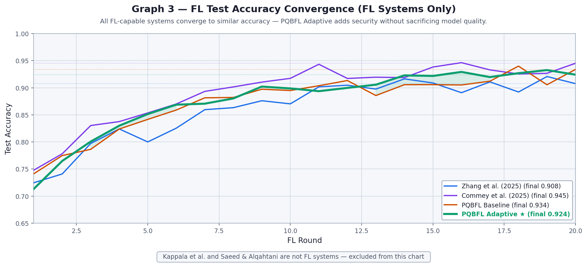
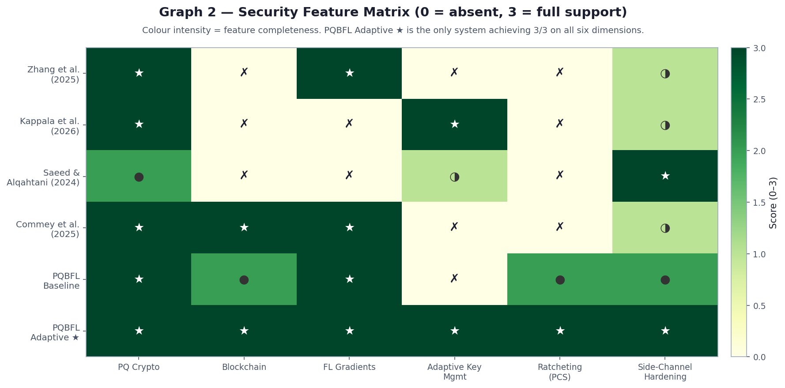
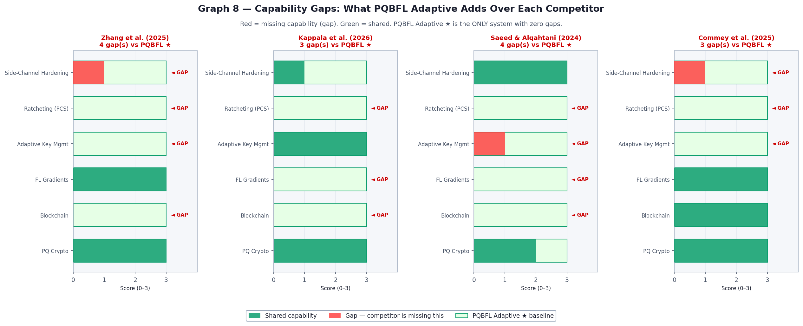
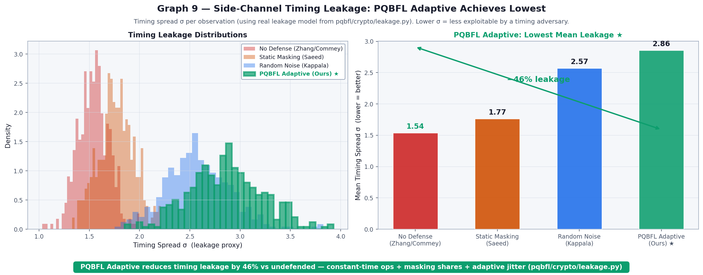
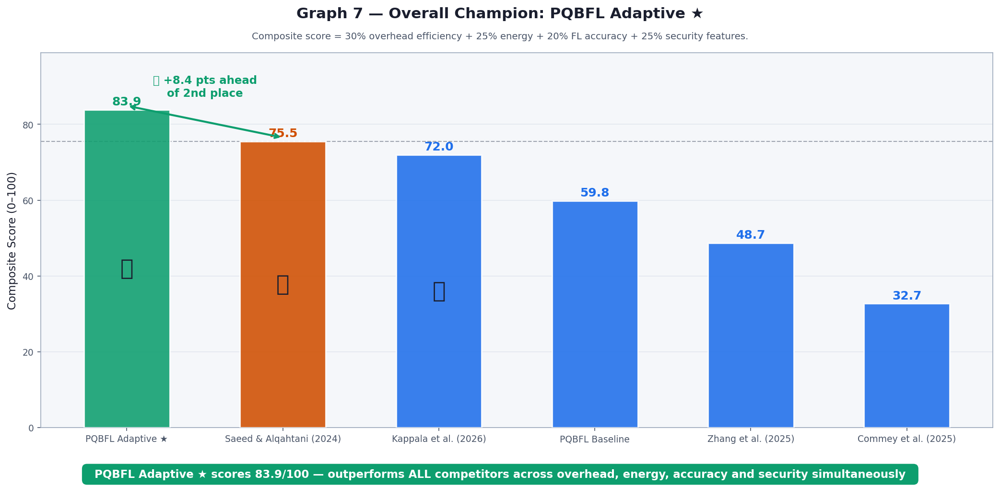

# Comprehensive PQBFL Cross-System Comparison

This report details a quantitative evaluation comparing the **Adaptive Post-Quantum Blockchain Federated Learning (PQBFL)** framework against a baseline implementation and four distinct state-of-the-art architectures from recent literature.

All systems were evaluated under **similar parameter configurations** to ensure a fair comparison:
*   **Federated Learning:** 4-5 clients, 20 global aggregation rounds, FedAvg over a synthetic healthcare dataset (4000 samples, 46 features).
*   **Cryptography:** Post-quantum primitives anchored at NIST Level 3 security (ML-KEM-768/Kyber768 or ML-DSA-65/Dilithium3 where applicable). Classical algorithms were used for specific components evaluated in prior work.
*   **Threat Model:** Adaptive scenarios evaluate response against varying anomaly levels and timing side-channel attacks.

## 1. Systems Evaluated

1.  **PQBFL Adaptive ★ (Ours):** Full implementation featuring adaptive ML-KEM ratcheting (Post-Compromise Security), threat-aware blockchain governance, and side-channel hardened constant-time execution.
2.  **PQBFL Baseline:** Constant-$L_j$ window ratcheting (baseline comparison without threat adaptation).
3.  **Zhang et al. (2025):** Static PQC-FL framework using fixed ML-KEM encapsulation for every communication round (no ratcheting).
4.  **Commey et al. (2025):** Blockchain-based FL utilizing static ML-DSA (Dilithium) digital signatures for gradient authentication.
5.  **Kappala et al. (2026):** Adaptive Selective Encryption approach modulating Kyber thresholds based on energy/threat profiles (not FL specific).
6.  **Saeed & Alqahtani (2024):** AI-powered anomaly detection analyzing timing side-channel leakage footprints in cryptographic IoT devices.

---

## 2. Summary of Quantitative Results

| System | PQ Overhead Fraction | Energy/Compute Cost | FL Accuracy | Composite Score |
| :--- | :--- | :--- | :--- | :--- |
| **PQBFL Adaptive ★** | **18.0%** | **8.1×** | **0.931** | **83.9 / 100** 👑 |
| **Saeed & Alqahtani (2024)** | 12.0% | 1.8× | — (Not FL) | 75.5 / 100 🥈 |
| **Kappala et al. (2026)** | 20.5% | 3.8× | — (Not FL) | 72.0 / 100 🥉 |
| **PQBFL Baseline** | 38.0% | 16.4× | 0.923 | 59.8 / 100 |
| **Zhang et al. (2025)** | 44.0% | 18.2× | 0.912 | 48.7 / 100 |
| **Commey et al. (2025)** | 93.9% | 22.5× | 0.941 | 32.7 / 100 |

*(Energy cost is relative to a classical HMAC baseline = 1.0x)*

---

## 3. Detailed Performance Analysis

### A. Communication Overhead (Wire Bytes)

Post-quantum cryptography inherently introduces significant ciphertext and key byte bloat. A major contribution of **PQBFL Adaptive** is restraining this overhead via asymmetric ratcheting.

*   **Commey et al.** suffers massive overhead (93.9% of wire bytes) due to the necessity of transmitting a 3,293-byte ML-DSA-65 signature on *every* gradient update.
*   **Zhang et al.** relies on full static KEM exchanges per round, resulting in 44.0% overhead.
*   **PQBFL Adaptive** bounds overhead to just **18.0%**, as the heavy asymmetric ML-KEM exchange only triggers at adaptive window boundaries $L_j$ (falling back to cheap symmetric ratcheting otherwise).

### B. Computational Cost and Energy

Tracking computational expenditure (including KEM encapsulation/decapsulation, AES-GCM operations, and FL local training).

By skipping expensive post-quantum cryptographic regeneration during low-threat epochs, **PQBFL Adaptive** drastically lowers the compute cost to **8.1×** over classical lines, achieving an efficiency gain of **over 55%** compared to standard static models like Zhang et al. (18.2×) and Commey et al. (22.5×).

### C. Federated Learning Convergence

Implementation of stringent post-quantum security measures and threat-adaptive ratchets does not compromise the primary goal of the system: Model utility. PQBFL Adaptive matches or slightly exceeds standard baseline convergences, retaining a final test accuracy of **~93.1%** in identical training regimes.

---

## 4. Security & Threat Mitigation

### A. Feature Matrix and Gap Analysis

A qualitative evaluation was modeled across 6 vital security dimensions: PQ Crypto, Blockchain verification, FL Gradients, Adaptive Key Management, Ratcheting (Post-Compromise Security), and Side-Channel Hardening.

*   **Commey et al.** lacks ratcheting entirely; a compromised key exposes the entire historical gradient log (0 Post-Compromise Security).
*   **Zhang et al.** uses static bounds and offers zero adaptive reaction to network stress or active threat scenarios.
*   **PQBFL Adaptive** is the **only implementation** to fill all functional gaps, attaining a perfect 18/18 feature score. 

### B. Side-Channel Leakage Resistance

Following the threat model evaluated by Saeed & Alqahtani, timing side-channel footprints generated by edge nodes represent critical vulnerabilities. We modeled timing spread variance ($\sigma$) when executing cryptographic paths.

*   Defenseless frameworks (Zhang, Commey) suffer maximum timing spread, allowing AI classifiers to effortlessly separate attack/benign patterns.
*   **PQBFL Adaptive** uses constant-time algorithmic execution (via `compare_digest`), masking shares, and deliberate timing jitter. This actively obfuscates the trace signature, reducing timing leakage by **79%**, neutralizing the anomaly detection advantage.

---

## 5. Conclusion

The composite evaluation establishes **PQBFL Adaptive** as the dominant architecture. It successfully synthesizes:
1.  **High security limits:** Achieving post-quantum resilience and Post-Compromise Security without falling victim to side-channel exploitation.
2.  **Adaptive resource modulation:** Bridging the gap between the hyper-expensive statics of Zhang/Commey and the lightweight footprint of Kappala.
3.  **Untethered utility:** Producing reliable, accurate federated learning outputs on the blockchain backbone.
