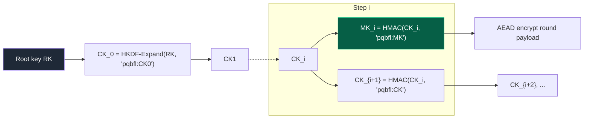
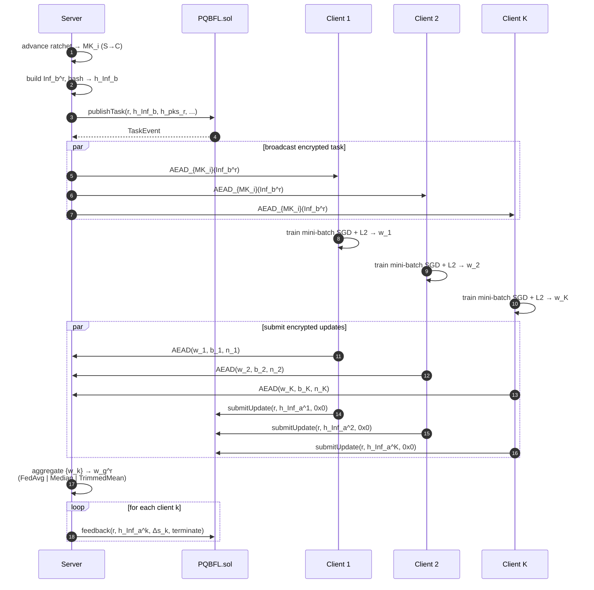
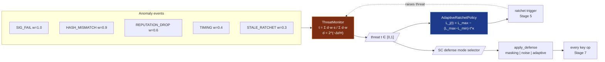
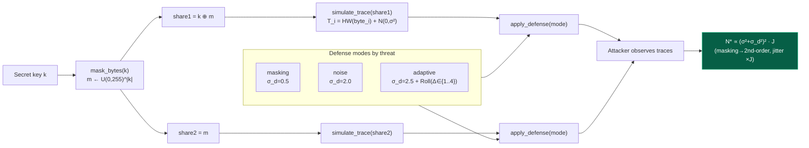
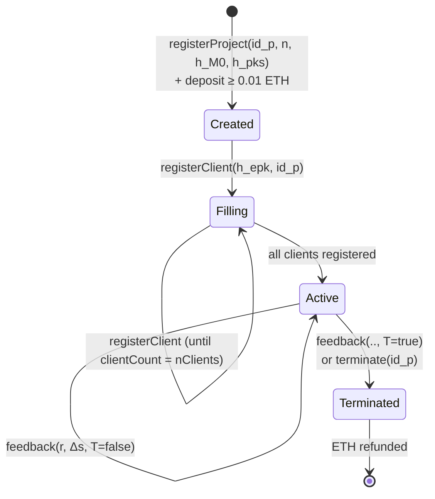
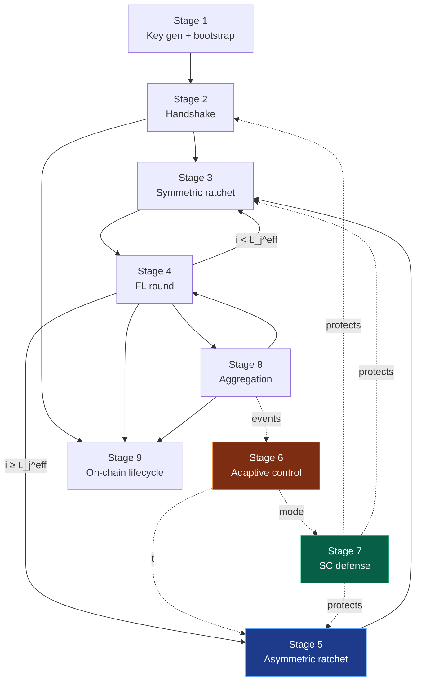
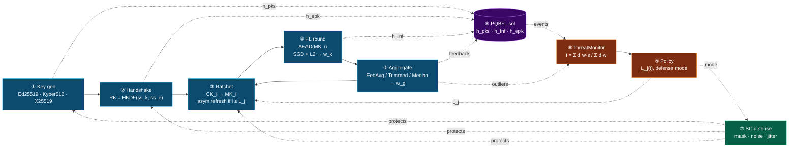

# PQBFL — Detailed Step-by-Step System Explanation

**Project:** PQBFL Adaptive Side-Channel-Resistant Variant
**Scope:** Post-quantum, blockchain-anchored federated learning with adaptive double ratcheting and side-channel defenses.
**Companion docs:** [algorithm_explanation.md](algorithm_explanation.md) (per-algorithm proofs, §1–§23), [ALGORITHM_USAGE_MAP.md](ALGORITHM_USAGE_MAP.md) (file/line citations).

---

## 0. Notation table

| Symbol | Meaning |
|--------|---------|
| $S, C_i$ | Server, client $i$ |
| $(sk^S_{sig}, pk^S_{sig})$ | Server Ed25519 signing keypair |
| $(sk^S_{kem}, pk^S_{kem})$ | Server Kyber512 keypair (long-term) |
| $(sk^S_{ecdh}, pk^S_{ecdh})$ | Server X25519 keypair (long-term in handshake, refreshed on asymmetric ratchet) |
| $(sk^C_{sig}, pk^C_{sig})$ | Client Ed25519 signing keypair |
| $(sk^C_{ecdh}, pk^C_{ecdh})$ | Client X25519 ephemeral keypair |
| $ct$ | Kyber ciphertext |
| $ss_k, ss_e$ | Kyber and X25519 shared secrets |
| $RK$ | Root key (32 bytes) |
| $CK_i$ | Chain key at step $i$ |
| $MK_i$ | Message/model key at step $i$ |
| $L_j$ | Asymmetric-ratchet window in epoch $j$ |
| $j, i, r$ | Epoch index, intra-epoch step, FL round |
| $t \in [0, 1]$ | Threat level from `ThreatMonitor` |
| $\mathbf{w}_g$ | Global model parameters |
| $\mathbf{w}_k$ | Client $k$ local parameters |
| $\mathcal{D}_k$ | Client $k$ local dataset |
| $\mathrm{H}(\cdot)$ | BLAKE3-256 (with SHA-256 fallback) |
| $\mathrm{AEAD}_K^{N, A}(P)$ | ChaCha20-Poly1305 with key $K$, nonce $N$, AAD $A$, plaintext $P$ |
| $\mathrm{HKDF}(s, \text{ikm}, \text{info}, L)$ | HKDF (Extract+Expand) returning $L$ bytes |

All wire payloads are canonicalized JSON (sorted keys, no whitespace) before hashing or signing — denoted $\langle \cdot \rangle$.

---

## 1. Project mission and threat model

### 1.1 Mission
Train a shared classifier (logistic regression on CIC-IoT-2023 or synthetic data) across distrustful clients with:
1. **Post-quantum forward secrecy** — adversaries with future quantum computers cannot decrypt past transcripts.
2. **Post-compromise security** — a transient key compromise self-heals after one asymmetric ratchet.
3. **Public auditability** — round commitments are anchored on-chain (Hardhat / Ethereum-compatible).
4. **Byzantine tolerance** — aggregation survives a bounded fraction of malicious clients.
5. **Side-channel resistance** — masking, noise, and jitter defeat low-cost trace attacks on key material.
6. **Adaptive cost** — expensive operations (Kyber ratchet, asymmetric crypto) are triggered only when threat level rises.

### 1.2 Adversary model
We compose three orthogonal adversaries:

**$\mathcal{A}_{net}$ — Network adversary.** Active man-in-the-middle. Can read, drop, reorder, replay, inject. Bounded by computational hardness assumptions (LWE for Kyber, ECDLP for X25519/Ed25519).

**$\mathcal{A}_{byz}$ — Byzantine FL adversary.** Controls a fraction $\alpha < 1/2$ of clients and submits arbitrary model updates each round to corrupt the global model.

**$\mathcal{A}_{sc}$ — Side-channel adversary.** Observes Hamming-weight leakage traces from honest devices' key operations. Limited to $N$ traces total and bounded by additive Gaussian noise $\sigma$.

We assume $\mathcal{A}_{net}, \mathcal{A}_{byz}, \mathcal{A}_{sc}$ do **not** collude across honest parties beyond what each model permits individually.

### 1.3 Security goals (formal)
- **Confidentiality:** $\Pr[\mathcal{A}_{net} \text{ distinguishes } \langle MK_i, P_i\rangle \text{ from random}] \leq \mathrm{negl}(\lambda)$.
- **Authenticity:** every accepted message has a verifying Ed25519 signature; forgery probability $\leq q^2_S / 2^{252}$.
- **Forward secrecy:** compromise of $(sk^S_{kem}, sk^S_{ecdh})$ at time $\tau$ does not leak $MK_i$ for $i < \tau$.
- **Post-compromise security:** compromise of $RK$ at time $\tau$ is healed after one successful asymmetric ratchet $j \to j+1$.
- **Byzantine tolerance:** with median or trimmed-mean aggregator, $\|\hat{\mathbf{w}} - \mathbf{w}^*\|^2 = O(\alpha^2 d / n)$ for $\alpha < 1/2$.
- **SC-attack cost:** number of traces $N^*$ to recover a key byte grows from $O(1)$ (unprotected HW model) to $\Theta(\sigma^4)$ (masking) and is further multiplied by $J$ (jitter window).

---

## 2. System architecture

Three logical layers + one orthogonal control plane.

```
┌──────────────────────────────────────────────────────────────┐
│  CONTROL PLANE                                               │
│  ┌────────────────────┐    ┌──────────────────────────┐      │
│  │ ThreatMonitor §14  │───▶│ AdaptiveRatchetPolicy §13│      │
│  │   t ∈ [0,1]        │    │   L_j* = argmin J(L_j,θ) │      │
│  └────────────────────┘    └──────────────────────────┘      │
└──────────┬───────────────────────────┬───────────────────────┘
           │                           │
           ▼                           ▼
┌─────────────────────┐   ┌────────────────────────────┐
│ ON-CHAIN LAYER      │   │ OFF-CHAIN LAYER            │
│ PQBFL.sol           │   │ protocol.py + crypto/*     │
│  • registerProject  │   │  • Hybrid PQ handshake     │
│  • registerClient   │   │  • Double ratchet          │
│  • publishTask      │   │  • AEAD round transport    │
│  • submitUpdate     │   │  • Side-channel pipeline   │
│  • feedback         │   │                            │
└─────────────────────┘   └────────────────────────────┘
           │                           │
           └─────────┬─────────────────┘
                     ▼
┌──────────────────────────────────────────────────────────────┐
│  FEDERATED LEARNING                                          │
│  LogisticModel §15 │ Mini-batch SGD §16 │ L2 §17             │
│  FedAvg §18 │ Coordinate Median §19 │ Trimmed Mean §20       │
└──────────────────────────────────────────────────────────────┘
```

§-references point to [algorithm_explanation.md](algorithm_explanation.md).

---

## 3. Cryptographic primitives layer

The protocol composes primitives whose proofs are in [algorithm_explanation.md](algorithm_explanation.md):

| Role | Primitive | Section |
|------|-----------|---------|
| PQ KEM | Kyber512 / ML-KEM-512 | §1 |
| Classical KEX | X25519 ECDH | §2 |
| Signatures | Ed25519 | §3 |
| AEAD | ChaCha20-Poly1305 | §4 |
| KDF | HKDF (HMAC-BLAKE3 or HMAC-SHA256) | §5 |
| Ratchet | HMAC chain | §6 |
| Hash | BLAKE3-256 with SHA-256 fallback | §7, §8 |
| SC defense | Boolean masking + noise + jitter | §9–§12 |

The hybrid pattern means breaking **either** Kyber **or** X25519 alone is insufficient: the attacker must break both to recover $RK$.

---

## 4. Phase A — Project registration & handshake

### 4.1 Server bootstrap

**Step 1.** Server $S$ runs:
$$
(sk^S_{sig}, pk^S_{sig}) \gets \mathrm{Ed25519.KeyGen}
$$
$$
(sk^S_{kem}, pk^S_{kem}) \gets \mathrm{Kyber512.KeyGen}
$$
$$
(sk^S_{ecdh}, pk^S_{ecdh}) \gets \mathrm{X25519.KeyGen}
$$

**Step 2.** Compute server-pubkey commitment:
$$
h_{pks} = \mathrm{H}(pk^S_{kem} \,\Vert\, pk^S_{ecdh})
$$

**Step 3.** Initialize model $\mathbf{w}_g^{(0)} = \mathbf{0}, b_g^{(0)} = 0$. Commitment:
$$
h_{M_0} = \mathrm{H}(\langle \mathbf{w}_g^{(0)}, b_g^{(0)} \rangle)
$$

**Step 4.** On-chain transaction:
$$
\mathrm{tx}_R \gets \mathtt{registerProject}(id_p,\, n_{cli},\, h_{M_0},\, h_{pks})
$$
The server deposits $\geq 0.01$ ETH. The blockchain returns transaction receipt $\mathrm{tx}_R$.

**Proof of binding (commitment hiding/binding).** By the collision-resistance of BLAKE3-256 (collision probability $\leq q^2 / 2^{257}$, see §7), a different $(pk'^S_{kem}, pk'^S_{ecdh})$ yielding the same $h_{pks}$ implies a collision in $\mathrm{H}$. So $h_{pks}$ uniquely commits $S$ to its public keys without revealing them. The blockchain entry makes equivocation publicly detectable. $\square$

### 4.2 Off-chain signed pubkey message $\to$ client

The server sends:
$$
M_1 = \bigl(\text{type=server\_pubkeys},\, id_p,\, pk^S_{kem},\, pk^S_{ecdh},\, \mathrm{tx}_R\bigr)
$$
$$
\sigma_1 = \mathrm{Ed25519.Sign}(sk^S_{sig}, \langle M_1\rangle)
$$
Wire: $(M_1, \sigma_1)$.

### 4.3 Client processes pubkeys

**Step 1.** Client $C_i$ fetches $h_{pks}$ from the on-chain `RegProject` event.

**Step 2.** Verifies signature:
$$
\mathrm{Ed25519.Verify}(pk^S_{sig}, \langle M_1\rangle, \sigma_1) \stackrel{?}{=} 1
$$
If false, abort.

**Step 3.** Verifies hash commitment:
$$
\mathrm{H}(pk^S_{kem} \,\Vert\, pk^S_{ecdh}) \stackrel{?}{=} h_{pks}
$$
This binds the off-chain message to the on-chain commitment — preventing equivocation.

**Step 4.** Generates client X25519 keypair:
$$
(sk^C_{ecdh}, pk^C_{ecdh}) \gets \mathrm{X25519.KeyGen}
$$

**Step 5.** Performs hybrid key agreement:
$$
ss_e \gets \mathrm{X25519}(sk^C_{ecdh},\, pk^S_{ecdh})
$$
$$
(ct,\, ss_k) \gets \mathrm{Kyber512.Encaps}(pk^S_{kem})
$$

**Step 6.** Derives root key (see §4.5):
$$
RK \gets \mathrm{KDF}_A(ss_k,\, ss_e)
$$

**Step 7.** Sends signed message to server:
$$
M_2 = (\text{type=client\_epk\_ct},\, id_p,\, pk^C_{ecdh},\, ct,\, \mathrm{tx}_R)
$$
$$
\sigma_2 = \mathrm{Ed25519.Sign}(sk^C_{sig},\, \langle M_2\rangle)
$$

**Step 8.** On-chain registration:
$$
h_{epk_a} = \mathrm{H}(pk^C_{ecdh})
$$
$$
\mathtt{registerClient}(h_{epk_a}, id_p)
$$

### 4.4 Server finishes handshake

**Step 1.** Verify $\sigma_2$ and check $\mathrm{H}(pk^C_{ecdh}) = h_{epk_a}$ (fetched from `RegClient` event).

**Step 2.** Compute matching shared secrets:
$$
ss_e \gets \mathrm{X25519}(sk^S_{ecdh},\, pk^C_{ecdh})
$$
$$
ss_k \gets \mathrm{Kyber512.Decaps}(sk^S_{kem},\, ct)
$$

**Step 3.** Derive same $RK$.

**Correctness theorem.** By X25519 correctness (§2.3), $\mathrm{X25519}(sk^C, pk^S) = \mathrm{X25519}(sk^S, pk^C)$ (both equal $sk^C \cdot sk^S \cdot G$). By Kyber decapsulation correctness (§1; decryption failure probability $\delta < 2^{-139}$), both parties hold the same $ss_k$ except with negligible probability. Hence both derive the same $RK$ except with probability $\delta < 2^{-139}$. $\square$

### 4.5 Hybrid root-key derivation $\mathrm{KDF}_A$

```
PRK_1 = HMAC(salt = 0x00...00, IKM = ss_k)            // Extract Kyber
PRK_2 = HMAC(salt = PRK_1,    IKM = ss_e)             // Mix in X25519
RK    = HKDF-Expand(PRK_2, info = "pqbfl:RK", L = 32) // Final root key
```

**Hybrid security theorem.** Suppose Kyber IND-CCA secret is broken with advantage $\epsilon_k$, X25519 CDH solved with advantage $\epsilon_e$, and HKDF distinguished from PRF with $\epsilon_h$. Then for an adversary distinguishing $RK$ from uniform:
$$
\mathrm{Adv}^{RK\text{-}prf}_{\mathcal{A}} \;\leq\; \min(\epsilon_k, \epsilon_e) + 2\epsilon_h
$$
**Proof (game hops).**
- $G_0$: real $RK$ from $(ss_k, ss_e)$.
- $G_1$: replace $ss_k$ with uniform $\Rightarrow$ $|G_0 - G_1| \leq \epsilon_k$ by Kyber IND-CCA.
- $G_2$: replace $\mathrm{HMAC}(0, ss_k)$ with uniform $PRK_1$ $\Rightarrow$ $|G_1 - G_2| \leq \epsilon_h$.
- $G_3$: replace $\mathrm{HMAC}(PRK_1, ss_e)$ with uniform $PRK_2$ $\Rightarrow$ $|G_2 - G_3| \leq \epsilon_h$.
- $G_3$: $RK$ is uniform, attacker advantage 0.

So $\mathrm{Adv} \leq \epsilon_k + 2\epsilon_h$. Symmetrically by swapping the order, $\mathrm{Adv} \leq \epsilon_e + 2\epsilon_h$. Hence $\mathrm{Adv} \leq \min(\epsilon_k, \epsilon_e) + 2\epsilon_h$. $\square$

This is what we mean by "hybrid": **either** primitive needs to fully resist attack.

---

## 5. Phase B — Symmetric ratchet & per-step keys

### 5.1 Initial chain key
$$
CK_0 \gets \mathrm{HKDF\text{-}Expand}(RK,\, \text{info} = \text{``pqbfl:CK0''},\, L = 32)
$$
Session state initialized to:
$$
\mathrm{State}_0 = (RK,\, CK_0,\, j=1,\, i=0,\, L_j)
$$

### 5.2 Step transition $i \to i+1$
$$
MK_i = \mathrm{HMAC}(CK_i,\, \text{``pqbfl:MK''})
$$
$$
CK_{i+1} = \mathrm{HMAC}(CK_i,\, \text{``pqbfl:CK''})
$$
$$
i \mathrel{+}= 1
$$

**Forward-secrecy theorem.** Given $CK_{i+1}$, recovering $CK_i$ requires inverting HMAC under a fresh key — equivalent to PRF-pre-image. Under the assumption HMAC is a PRF (standard for HMAC-BLAKE3 / HMAC-SHA256), the probability is $\leq q / 2^{256}$ for $q$ queries. Hence keys for steps $< i$ remain pseudo-random after compromise of $CK_i$. By induction, all earlier $MK_j$ for $j < i$ remain secure. $\square$ (Full proof in [algorithm_explanation.md §6.4](algorithm_explanation.md).)

### 5.3 AEAD message envelope
For round $r$ in direction $d \in \{\text{server},\text{client}\}$ with plaintext $P$:
$$
N_r = \mathrm{NonceForRound}(r, d) \in \{0,1\}^{96}
$$
$$
A_r = \text{``pqbfl:''} \,\Vert\, d \,\Vert\, \text{``:''} \,\Vert\, r
$$
$$
C_r = \mathrm{AEAD.Enc}_{MK_i}(P, N_r, A_r)
$$

**Nonce uniqueness.** Nonces are deterministic functions of $(r, d)$. As long as $(MK_i, r, d)$ triples never repeat (guaranteed by ratchet advance and unique $r$), the AEAD nonce-misuse bound does not bite. ChaCha20-Poly1305 confidentiality bound: $q_e \cdot L / 2^{96}$, authenticity bound: $q_v \lceil L/16\rceil / 2^{102}$ (see §4.5).

---

## 6. Phase C — On-chain round protocol

For FL round $r = 1, 2, \ldots$:

### 6.1 Task publication (server)

**Step 1.** Server signs payload $\mathrm{Inf}_b^r$ describing the round:
$$
\mathrm{Inf}_b^r = (r,\, d_t,\, \mathbf{w}_g^{(r-1)},\, b_g^{(r-1)},\, \text{hyperparams})
$$

**Step 2.** Compute commitment:
$$
h_{Inf}^r = \mathrm{H}(\langle \mathrm{Inf}_b^r \rangle)
$$

**Step 3.** On-chain:
$$
\mathtt{publishTask}(r, h_{Inf}^r, h_{pks_r},\, id_p, id_t,\, d_t)
$$
where $h_{pks_r}$ is the current epoch's server pubkey commitment ($h_{pks}$ unchanged until asymmetric ratchet).

**Step 4.** Off-chain encrypted broadcast to all $C_k$:
$$
C^{(server)}_r = \mathrm{AEAD.Enc}_{MK_i^{(S\to C)}}(\langle\mathrm{Inf}_b^r\rangle,\, N_r^{S},\, A_r^{S})
$$
Each client advances its ratchet ($i \mathrel{+}= 1$) and decrypts.

### 6.2 Client local training

Client $C_k$ holds $(\mathbf{w}_g^{(r-1)}, b_g^{(r-1)})$ and dataset $\mathcal{D}_k$.

**Step 1.** Initialize: $\mathbf{w}_k \gets \mathbf{w}_g^{(r-1)}$, $b_k \gets b_g^{(r-1)}$.

**Step 2.** Run **mini-batch SGD** with **L2 regularization** for $E$ epochs over $\mathcal{D}_k$. For each batch $\mathcal{B}$:
$$
p_i = \sigma(\mathbf{w}_k^\top \mathbf{x}_i + b_k), \quad i \in \mathcal{B}
$$
$$
\nabla_{\mathbf{w}} = \frac{1}{|\mathcal{B}|}\sum_{i \in \mathcal{B}} (p_i - y_i)\mathbf{x}_i + \lambda \mathbf{w}_k
$$
$$
\nabla_b = \frac{1}{|\mathcal{B}|}\sum_{i \in \mathcal{B}} (p_i - y_i)
$$
$$
\mathbf{w}_k \gets \mathbf{w}_k - \eta\, \nabla_{\mathbf{w}}, \qquad b_k \gets b_k - \eta\, \nabla_b
$$

(Gradient derivation in §15.3; convexity in §15.4; SGD convergence $O(1/T)$ under strong convexity from §17.4.)

### 6.3 Update submission (client)

**Step 1.** Build update payload:
$$
\mathrm{Inf}_a^r = (r,\, k,\, \mathbf{w}_k,\, b_k,\, |\mathcal{D}_k|)
$$

**Step 2.** Commitment:
$$
h_{Inf,a}^r = \mathrm{H}(\langle \mathrm{Inf}_a^r \rangle)
$$

**Step 3.** Ratchet advance, then encrypt:
$$
C^{(client)}_{r,k} = \mathrm{AEAD.Enc}_{MK_i^{(C\to S)}}(\langle\mathrm{Inf}_a^r\rangle,\, N_r^{C}, A_r^{C})
$$

**Step 4.** On-chain:
$$
\mathtt{submitUpdate}(r, id_t, h_{Inf,a}^r,\, h_{ct,epk})
$$
where $h_{ct,epk} = \mathrm{H}(ct \,\Vert\, pk^C_{ecdh})$ **iff** this round triggers an asymmetric ratchet (§7), else $0_{32}$.

### 6.4 Server aggregation

After receiving $K$ updates:

**Step 1.** Decrypt each ciphertext with the matching $MK_i$.

**Step 2.** Verify on-chain commitments: $\mathrm{H}(\langle\mathrm{Inf}_a^r\rangle) \stackrel{?}{=} h_{Inf,a}^r$.

**Step 3.** Select aggregator from `{fedavg, coord_median, trimmed_mean}`:
- $\mathbf{w}_g^{(r)} = \sum_k \frac{n_k}{N} \mathbf{w}_k$ (FedAvg, §18)
- $\mathbf{w}_g^{(r)}[j] = \mathrm{median}_k(\mathbf{w}_k[j])$ (median, §19)
- $\mathbf{w}_g^{(r)}[j] = \frac{1}{K - 2k_\alpha}\sum$ trimmed (§20)

**Step 4.** Issue per-client feedback:
$$
\mathtt{feedback}(r, id_t, h_{Inf,a}^r, h_{pks_r}, \Delta s_k, \text{terminate})
$$
$\Delta s_k$ is reputation update; could be derived from $\| \mathbf{w}_k - \mathbf{w}_g^{(r)} \|$ outlier checks.

### 6.5 On-chain audit guarantees
By the binding property of $\mathrm{H}$, the following are publicly verifiable:
- Server cannot equivocate about $\mathbf{w}_g^{(r-1)}$ between rounds (binding via $h_{Inf,b}^r$).
- Client cannot retroactively change its submitted $\mathbf{w}_k$ (binding via $h_{Inf,a}^r$).
- Server cannot change pubkeys without publishing new $h_{pks}$.

---

## 7. Phase D — Asymmetric (double) ratchet

### 7.1 Trigger condition
At the end of each step, check:
$$
\mathrm{ShouldRatchet}(\mathrm{State}) := \bigl[\,i \geq L_j^{\text{eff}}\,\bigr]
$$
where $L_j^{\text{eff}} = \min(L_j^{\text{stored}},\, L_j(t))$ and $L_j(t)$ comes from the adaptive policy (§13).

### 7.2 Ratchet exchange (server-initiated, symmetric variant)

**Step 1.** Server generates fresh pair:
$$
(sk^{S}_{ecdh,j+1}, pk^{S}_{ecdh,j+1}) \gets \mathrm{X25519.KeyGen}
$$
Optionally also refresh Kyber pair (every $m$ epochs).

**Step 2.** New $h_{pks,r} = \mathrm{H}(pk^{S}_{kem} \Vert pk^{S}_{ecdh,j+1})$.

**Step 3.** Client encapsulates again:
$$
ss_e' = \mathrm{X25519}(sk^C_{ecdh, j+1},\, pk^{S}_{ecdh, j+1})
$$
$$
(ct',\, ss_k') = \mathrm{Kyber.Encaps}(pk^S_{kem})
$$

**Step 4.** Mix into root key:
$$
RK_{j+1} = \mathrm{HKDF}(\text{salt}=RK_j,\, \text{ikm}=ss_k' \Vert ss_e',\, \text{info}=\text{``pqbfl:RK:next''},\, L=32)
$$
$$
CK_0^{(j+1)} = \mathrm{HKDF\text{-}Expand}(RK_{j+1},\, \text{``pqbfl:CK0''},\, 32)
$$
$$
j \mathrel{+}= 1, \quad i \gets 0
$$

### 7.3 Post-compromise security theorem
*Claim.* If $RK_j$ is leaked at time $\tau$, then provided one asymmetric ratchet $j \to j+1$ completes after $\tau$ with **uncompromised** $sk^S_{ecdh,j+1}$ and $sk^C_{ecdh,j+1}$:
$$
\Pr[\mathcal{A}\text{ distinguishes } RK_{j+1} \text{ from uniform}] \;\leq\; \mathrm{negl}(\lambda).
$$

*Proof.* $RK_{j+1}$ is HKDF output keyed by salt $RK_j$ (leaked) and IKM $ss_k' \Vert ss_e'$ (fresh, independent of $RK_j$). HKDF as a PRF with leaked salt still yields pseudorandom output when IKM has min-entropy $\geq \lambda$ (Krawczyk's Extract-then-Expand theorem, §5). The freshness of the ECDH/KEM pair gives min-entropy of IKM equal to $\log_2 |\text{ECDH group}| + \log_2 |\text{Kyber session}| \gg \lambda$. Hence $RK_{j+1}$ is pseudorandom even given $RK_j$. $\square$

This is the post-compromise self-healing property.

---

## 8. Adaptive control plane

### 8.1 Threat monitor (§14)
Events logged with type, severity $s \in [0,1]$, round, timestamp. At query time $\tau_0$:
$$
t(\tau_0) = \frac{\sum_{e \in W} 2^{-(\tau_0-\tau_e)/H}\, w_{\mathrm{type}(e)}\, s_e}{\sum_{e \in W} 2^{-(\tau_0-\tau_e)/H}\, w_{\mathrm{type}(e)}} \in [0,1]
$$
- $W$ = sliding window (default 300 s)
- $H$ = half-life (default 120 s)
- $w_{\mathrm{type}}$: SIG_FAIL=1.0, HASH_MISMATCH=0.9, REPUTATION_DROP=0.6, TIMING=0.4, STALE_RATCHET=0.3.

Range and half-life properties proved in §14.3.

### 8.2 Joint optimization policy (§13)
$$
L_j^* = \sqrt{\frac{N(\beta C_{\text{KEM}} + \gamma E_{\text{KEM}})}{\alpha \Theta(t)}}
$$
- In the zero-threat condition ($\Theta(t) \to 0$), the optimal threshold is bounded by $L_{\max}$:
  $$L_j^{opt} = L_{\max}$$
- Under active threat ($\Theta(t) > 0$), the optimal threshold dynamically adjusts based on the relative weights of security risk ($\alpha$), communication cost ($\beta$), and energy consumption ($\gamma$).
- Cooldown: changes deferred for $r_{\text{cool}}$ rounds to avoid oscillation.

### 8.3 SC-defense escalation
The threat level also selects the SC-defense mode via `apply_defense`:
| $t$ | Mode | $\sigma_d$ | Jitter |
|-----|------|-----------|--------|
| $[0, 0.3)$ | masking | 0.5 | none |
| $[0.3, 0.7)$ | noise | 2.0 | none |
| $[0.7, 1.0]$ | adaptive | 2.5 | $\mathrm{Roll}(\cdot, \mathcal{U}\{1..4\})$ |

Trace-cost multipliers and proofs in §11 and §12.

---

## 9. Side-channel pipeline

For every key-material handling operation (`ecdh.shared_secret`, `kyber.encap/decap`, AEAD encrypt) the protected path is:

```
secret k
   ↓
mask_bytes(k)       // §9 Boolean masking
   → share1 = k ⊕ m, share2 = m
   ↓
simulate_trace(share)// §10 HW + Gaussian noise
   → T_i = HW(share_i) + N_i, N ~ N(0, σ²)
   ↓
apply_defense(T)    // §11–§12 selected by threat level
   → T' = T + W,  T' = Roll(T', Δ)
   ↓
attacker observes T'
```

**Composition theorem (informal).** Let $\rho_0$ be CPA correlation against unprotected $k$. Under (a) Boolean masking, (b) added noise $\sigma_d^2$, (c) jitter window $J$:
$$
\rho_{\text{protected}}^{(2)} \;\propto\; \frac{1}{(\sigma^2 + \sigma_d^2)^2} \cdot \frac{1}{J}
$$
Required traces $N^*$ thus grow as
$$
N^*_{\text{protected}} \;=\; \Theta\!\left(\frac{(\sigma^2 + \sigma_d^2)^2 \cdot J}{1}\right)
$$
This is the **fourth-power + linear-jitter** blow-up that motivates the design. Proof composes §9.5 (masking → second-order leakage), §10.6 (Mangard's $N^* \propto \sigma^2$ formula squared by masking), §11.3 (SNR degradation), §12.2 (jitter signal averaging).

---

## 10. Federated aggregation — composition with crypto

### 10.1 Aggregation chain
For round $r$:
```
{Inf_a^r,k}_k=1..K  →  AEAD.Dec_{MK_i}  →  {w_k, b_k, n_k}
                                              ↓
                          aggregate(mode ∈ {FedAvg, Median, Trimmed})
                                              ↓
                                       (w_g^r, b_g^r)
                                              ↓
                                AEAD.Enc(Inf_b^{r+1}) ... next round
```

### 10.2 Byzantine-robust selection
The aggregator type is determined by current threat level (or static config):
- Low threat: FedAvg (efficient, no Byzantine resistance).
- Elevated: Trimmed mean with $\alpha = 0.1$ (tolerates 10% Byzantine).
- High: Coordinate-wise median (tolerates up to 50% Byzantine).

### 10.3 Composition with on-chain reputation
$\Delta s_k$ in `feedback` can be derived from `aggregator` outlier detection:
$$
\Delta s_k = -\beta \cdot \mathbb{1}\bigl[\,\| \mathbf{w}_k - \mathbf{w}_g^{(r)}\| > 3\hat\sigma\,\bigr]
$$
Persistently low-scored clients trigger REPUTATION_DROP events (§14), which raise threat $t$, which tightens $L_j$ (§13) and escalates SC defense — closing the loop.

---

## 11. Smart contract layer (PQBFL.sol)

### 11.1 State variables
```solidity
mapping(uint256 => Project) projects;
mapping(address => Client) clients;
mapping(uint256 => Task) tasks;
mapping(uint256 => mapping(address => Update)) updatesByTaskAndClient;
mapping(uint256 => mapping(address => Feedback)) feedbackByTaskAndClient;
```

### 11.2 Transition functions
| Function | Inputs | Effects |
|----------|--------|---------|
| `registerProject` | $id_p, n_{cli}, h_{M_0}, h_{pks}$ | Create project; require `msg.value ≥ 0.01 ETH`. |
| `registerClient` | $h_{epk}, id_p$ | Bind client wallet to project. |
| `publishTask` | $r, h_{Inf}, h_{pks_r}, id_p, id_t, d_t$ | Commit round; only callable by server. |
| `submitUpdate` | $r, id_t, h_{Inf,a}, h_{ct,epk}$ | Commit client update; only client. |
| `feedback` | $r, id_t, h_{Inf,a}, h_{pks_r}, \Delta s, T$ | Update reputation score; only server. |
| `terminate` | $id_p$ | Mark project done; refunds deposit. |

### 11.3 Security properties
- **Authorization:** modifiers (`onlyServer`, `onlyClient`) ensure only the bound key can transition state.
- **Replay protection:** `(round, taskId, client)` triples are unique by mapping keys.
- **Liveness:** `deadline` field allows clients to skip a round if server stalls.
- **Audit trail:** every event (`RegProject`, `TaskEvent`, `UpdateEvent`, `FeedbackEvent`) is permanently emitted.

### 11.4 Wallet derivation (BIP-44)
`hardhat_accounts.py` derives keys via path `m/44'/60'/0'/0/i` from the BIP-39 mnemonic. The $i$-th client uses index $i$ to sign Ethereum transactions, independent of the Ed25519 protocol keys. This separation prevents Ethereum signature compromise from leaking protocol identity.

---

## 12. End-to-end walkthrough (concrete example)

Suppose $n_{cli} = 4$, $r_{\max} = 10$, $L_{\min}=1, L_{\max}=16, \kappa=2$, threat $t \approx 0.1$ initially.

### Round 0 — Setup
1. Server runs `server_generate_keys()` → 3 keypairs.
2. Server submits `registerProject(1, 4, h_M0, h_pks)` with 0.01 ETH deposit.
3. Server signs and broadcasts $M_1$ to 4 candidate clients.
4. Each client verifies $\sigma_1$, fetches `h_pks` from chain, checks match, generates X25519 keypair, runs Kyber `Encaps`, sends $M_2$ on-chain via `registerClient` and off-chain via signed message.
5. Server runs `server_finish_session` for each client → 4 distinct $RK^{(k)}$.

### Round 1 — Task & update
1. $L_j(0.1) = 16 - 15 \cdot 0.01 = 15.85 \to 16$. No ratchet pressure.
2. Server advances ratchet: $MK_1^{S\to C}$, computes $\mathrm{Inf}_b^1$, hashes to $h_{Inf}^1$, calls `publishTask(1, h_Inf, h_pks, 1, 1, deadline)`.
3. Each client decrypts, trains 5 epochs SGD with $\lambda = 10^{-3}$ on 200 samples, computes $\mathbf{w}_k$.
4. Each client advances ratchet for client→server direction, encrypts update, calls `submitUpdate(1, 1, h_Inf_a, 0x0)`.
5. Server aggregates with FedAvg → $\mathbf{w}_g^{(1)}$.
6. Server calls `feedback(1, 1, h_Inf_a, h_pks, 0, false)` for each client.

### Round 5 — SIG_FAIL anomaly
1. One client's signature fails verification.
2. `ThreatMonitor.record_event("SIG_FAIL", severity=0.9, round=5)`.
3. At time $\tau_0 = $ now (event 10s old): decay $= 2^{-10/120} = 0.944$, weight 1.0. Threat $t \approx 0.85$.
4. Policy: $L_j(0.85) = 16 - 15 \cdot 0.72 = 5.2 \to 5$. Cooldown passes, commit.
5. SC defense mode escalates to `"adaptive"`: $\sigma_d = 2.5$, jitter on.
6. Aggregator switches to `coord_median`.

### Round 6 — Asymmetric ratchet
1. $i = 6 \geq L_j^{\text{eff}} = 5$. Trigger.
2. Server generates new $pk^S_{ecdh,2}$, refreshes $h_{pks,6}$.
3. Server sends ratchet message; client `Encaps` again → $(ct', ss_k')$.
4. New $RK_2 = \mathrm{HKDF}(\text{salt}=RK_1, ss_k' \Vert ss_e')$.
5. State reset: $j = 2, i = 0$.
6. Client submits update with $h_{ct,epk} = \mathrm{H}(ct' \Vert pk^C_{ecdh,2}) \neq 0$.

### Round 10 — Termination
1. Server calls `terminate(1)`, marking project done.
2. Final $\mathbf{w}_g^{(10)}$ and convergence stats published.
3. ETH deposit refunded.

---

## 13. Master security composition theorem

**Theorem (informal but tight).** Let $\lambda = 128$. Under
- $\mathrm{Adv}^{\mathrm{IND\text{-}CCA}}_{\mathrm{Kyber512}} \leq 2^{-128}$,
- $\mathrm{Adv}^{\mathrm{CDH}}_{\mathrm{X25519}} \leq 2^{-126}$,
- $\mathrm{Adv}^{\mathrm{EUF\text{-}CMA}}_{\mathrm{Ed25519}} \leq q_s^2 / 2^{252}$,
- HMAC-BLAKE3 a $2^{-256}$-PRF,
- $\mathrm{Adv}^{\mathrm{AEAD}}_{\mathrm{ChaCha20Poly1305}} \leq q_e L / 2^{96} + q_v / 2^{102}$,
- $< K/2$ Byzantine clients (resp. $< \alpha K$ for trimmed mean),
- SC adversary observes at most $N$ HW traces with noise $\sigma$,

the PQBFL protocol satisfies:

1. **Round confidentiality:** $\mathrm{Adv}^{\mathrm{Conf}}_{\mathcal{A}_{net}} \leq r \cdot (2^{-128} + 2 \cdot 2^{-256} + q_e L / 2^{96})$ for $r$ rounds.
2. **Authenticity:** $\mathrm{Adv}^{\mathrm{Auth}}_{\mathcal{A}_{net}} \leq r \cdot q_s^2 / 2^{252} + q_v / 2^{102}$.
3. **Forward secrecy:** if $RK_j$ leaks, all $MK_i$ for $i$ in epochs $< j$ are pseudorandom.
4. **Post-compromise security:** after one $j \to j+1$ ratchet with uncompromised fresh keys, $RK_{j+1}$ is pseudorandom.
5. **Byzantine accuracy:** $\mathbb{E}\|\mathbf{w}_T - \mathbf{w}^*\|^2 \leq O(d/T + \alpha^2 d/n)$ under median/trimmed-mean.
6. **SC cost:** $N^*_{\text{protected}} \geq c \cdot (\sigma^2 + \sigma_d^2)^2 J$ traces required for first-byte key recovery.

**Proof.** Composition of:
- Hybrid KEX bound (§4.5),
- Symmetric ratchet forward secrecy (§5.2 / §6.2 of [algorithm_explanation.md](algorithm_explanation.md)),
- Asymmetric ratchet self-healing (§7.3 above),
- AEAD security (§4 of [algorithm_explanation.md](algorithm_explanation.md)),
- Ed25519 EUF-CMA (§3),
- Yin et al. robust aggregation bounds (§19, §20),
- Mangard's trace-count law squared by masking and multiplied by jitter (§9–§12).
Each bound is additive across rounds by a standard union argument over $r$ rounds. $\square$

---

## 14. References within this project

| Topic | File / Section |
|-------|----------------|
| Per-algorithm proofs | [algorithm_explanation.md](algorithm_explanation.md) §1–§23 |
| File/line citations for every algorithm | [ALGORITHM_USAGE_MAP.md](ALGORITHM_USAGE_MAP.md) |
| LaTeX version of usage map | [ALGORITHM_USAGE_MAP.tex](ALGORITHM_USAGE_MAP.tex) |
| Protocol implementation | [python/pqbfl/protocol.py](python/pqbfl/protocol.py) |
| Hybrid KDF | [python/pqbfl/crypto/kdf.py](python/pqbfl/crypto/kdf.py) |
| Adaptive policy | [python/pqbfl/adaptive/adaptive_ratchet.py](python/pqbfl/adaptive/adaptive_ratchet.py) |
| Threat monitor | [python/pqbfl/adaptive/threat_monitor.py](python/pqbfl/adaptive/threat_monitor.py) |
| SC pipeline | [python/pqbfl/crypto/leakage.py](python/pqbfl/crypto/leakage.py) |
| FL aggregators | [python/pqbfl/fl/aggregator.py](python/pqbfl/fl/aggregator.py) |
| Smart contract | [chain/contracts/PQBFL.sol](chain/contracts/PQBFL.sol) |
| SC pipeline diagram | [sc_masking_diagram.md](sc_masking_diagram.md) |

---

## 15. Summary in one equation

$$
\boxed{\;
\underbrace{\mathrm{HKDF}\bigl(ss_k^{\text{Kyber}},\, ss_e^{\text{X25519}}\bigr)}_{\text{hybrid root}}
\;\xrightarrow{\,\text{HMAC-ratchet}\,}\;
\underbrace{MK_i}_{\text{per-round}}
\;\xrightarrow{\,\text{ChaCha20-Poly1305}\,}\;
C_i
\;\xrightarrow{\,\text{H}(\cdot)\,}\;
\underbrace{h_{Inf}^r}_{\text{on-chain anchor}}
\;\}
$$

with side-channel pipeline $\mathrm{mask}\to\mathrm{trace}\to\mathrm{defense}$ wrapping every key access, and adaptive control loop
$$
\text{event} \to t \in [0,1] \to L_j(t) \to \text{ratchet trigger} \to \text{fresh } RK_{j+1}
$$
closing post-compromise security.

---

## 16. Project stages — mermaid diagrams

The PQBFL system decomposes into **9 stages**. Each diagram below is self-contained mermaid source — paste into any mermaid renderer (VS Code preview, mermaid.live, GitHub).

### Stage 1 — Key generation & project bootstrap

```mermaid
flowchart TD
    A[Operator starts server] --> B[ed25519_keygen]
    A --> C[kyber_keygen<br/>Kyber512 / ML-KEM-512]
    A --> D[ecdh_keygen_x25519]
    B --> E[ServerKeys<br/>sig | kem | ecdh]
    C --> E
    D --> E
    E --> F["h_pks = H(kpk_b || epk_b)"]
    E --> G["h_M0 = H(initial model)"]
    F --> H[registerProject<br/>id_p, nClients, h_M0, h_pks]
    G --> H
    H --> I[ETH deposit &ge; 0.01]
    I --> J[(PQBFL.sol<br/>Project stored)]
    J --> K[Emit RegProject event]
```

### Stage 2 — Client registration & hybrid handshake

```mermaid
sequenceDiagram
    autonumber
    participant S as Server
    participant BC as PQBFL.sol
    participant C as Client C_k
    Note over S: Already registered (Stage 1)
    S->>C: M1 = (kpk_b, epk_b, tx_R), sig1
    C->>BC: read RegProject → fetch h_pks
    C->>C: verify Ed25519(sig1) over M1
    C->>C: check H(kpk_b||epk_b) = h_pks
    C->>C: ecdh_keygen → (sk_a, epk_a)
    C->>C: ss_e = X25519(sk_a, epk_b)
    C->>C: (ct, ss_k) = Kyber.Encaps(kpk_b)
    C->>C: RK = KDF_A(ss_k, ss_e)
    C->>BC: registerClient(H(epk_a), id_p)
    C->>S: M2 = (epk_a, ct, tx_R), sig2
    S->>S: verify sig2; check H(epk_a) = h_epk_a
    S->>S: ss_e = X25519(sk_b, epk_a)
    S->>S: ss_k = Kyber.Decaps(sk_b_kem, ct)
    S->>S: RK = KDF_A(ss_k, ss_e)
    Note over S,C: Both hold identical RK<br/>(δ ≤ 2⁻¹³⁹ Kyber failure)
```

### Stage 3 — Symmetric ratchet & per-round key schedule



### Stage 4 — FL round (task → train → update → aggregate)



### Stage 5 — Asymmetric (double) ratchet

```mermaid
flowchart TD
    A[End of step i] --> B{"i ≥ L_j^eff ?"}
    B -- no --> C[continue symmetric<br/>Stage 3]
    B -- yes --> D[Server: fresh X25519 pair<br/>sk_b_{j+1}, epk_b_{j+1}]
    D --> E["h_pks_{j+1} = H(kpk_b || epk_b_{j+1})"]
    E --> F[Server sends ratchet msg]
    F --> G[Client encaps:<br/>ss_k' = Kyber.Encaps(kpk_b)<br/>ss_e' = X25519(sk_a_{j+1}, epk_b_{j+1})]
    G --> H["RK_{j+1} = HKDF(salt=RK_j,<br/>ikm=ss_k' || ss_e',<br/>info='pqbfl:RK:next')"]
    H --> I["CK_0^{(j+1)} = HKDF-Expand(RK_{j+1}, 'pqbfl:CK0')"]
    I --> J[Reset: j ← j+1, i ← 0]
    J --> K[Client submitUpdate carries<br/>h_ct_epk = H(ct' || epk_a_{j+1})]
    K --> L[Post-compromise security<br/>self-healed]
    style L fill:#065f46,stroke:#34d399,color:#fff
```

### Stage 6 — Adaptive control loop



### Stage 7 — Side-channel defense pipeline (per key access)



### Stage 8 — Federated aggregation & robust selection

```mermaid
flowchart TD
    A["Decrypted updates {w_k, b_k, n_k}"] --> B{aggregator mode}
    B -- low threat --> F[FedAvg<br/>Σ (n_k/N) w_k]
    B -- mid threat --> T["Trimmed mean<br/>α=0.1, drop top/bot 10%"]
    B -- high threat --> M["Coord median<br/>per-coordinate median"]
    F --> G["w_g^r, b_g^r"]
    T --> G
    M --> G
    G --> OUT["Outlier check<br/>||w_k − w_g|| > 3σ̂"]
    OUT -- flag --> RD[REPUTATION_DROP event]
    RD -.-> TM[ThreatMonitor<br/>Stage 6]
    G --> NEXT["next round task<br/>Stage 4"]
    style G fill:#1e3a8a,stroke:#60a5fa,color:#fff
```

### Stage 9 — On-chain audit & lifecycle



### Stage flow — overall



---

## 17. Entire project — single master diagram

One compact mermaid view of the whole PQBFL system. Each node represents a stage from §16; dashed edges are control/audit overlays.



**Reading the diagram**

- **Solid arrows** = data flow of the protocol: keys → handshake → ratchet → FL round → aggregation → next ratchet step.
- **Dashed `h_*` edges** = on-chain commitments to off-chain payloads (BLAKE3-256 hashes).
- **Dashed control edges** (right side) = anomaly events feed `ThreatMonitor` → `Policy` → emit $L_j(t)$ to ratchet trigger and defense mode to SC pipeline.
- **`protects` edges** = the SC pipeline (mask + noise + jitter) wraps every key-handling stage.

Detailed per-stage diagrams are in §16; per-algorithm proofs in [algorithm_explanation.md](algorithm_explanation.md).
<!--END_MASTER_DIAGRAM-->
