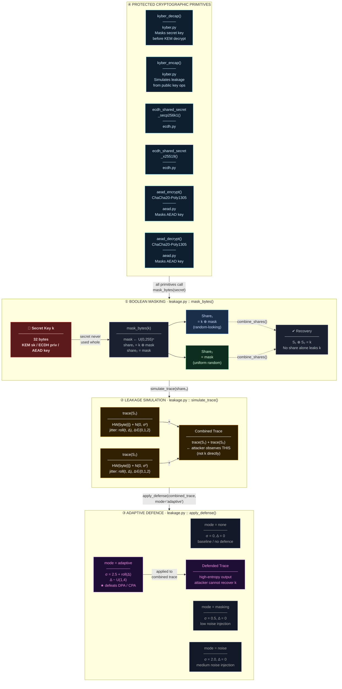

# Side-Channel Masking Pipeline — PQBFL Adaptive SC-Resistant Variant

## How the pipeline works

| Layer | Function | What it does |
|---|---|---|
| ① Boolean Masking | `mask_bytes(k)` | Splits secret `k` into `S₁ = k ⊕ mask` and `S₂ = mask`; no single share reveals `k` |
| ② Leakage Simulation | `simulate_trace(share)` | Models Hamming-weight power leakage + Gaussian noise + random temporal jitter per share |
| ③ Adaptive Defence | `apply_defense(trace, mode)` | Adds σ=2.5 noise and random roll shift in `adaptive` mode to defeat DPA/CPA correlation attacks |
| ④ Primitives | `kyber_decap`, `ecdh_*`, `aead_*` | Every secret-touching operation passes through layers ①→②→③ before and after use |

### Defence modes

| Mode | Noise σ | Jitter Δ | Use case |
|---|---|---|---|
| `none` | 0 | 0 | Baseline / testing |
| `masking` | 0.5 | 0 | Light protection |
| `noise` | 2.0 | 0 | Medium protection |
| `adaptive` | **2.5** | **U(1,4)** | **Full DPA/CPA resistance** |
