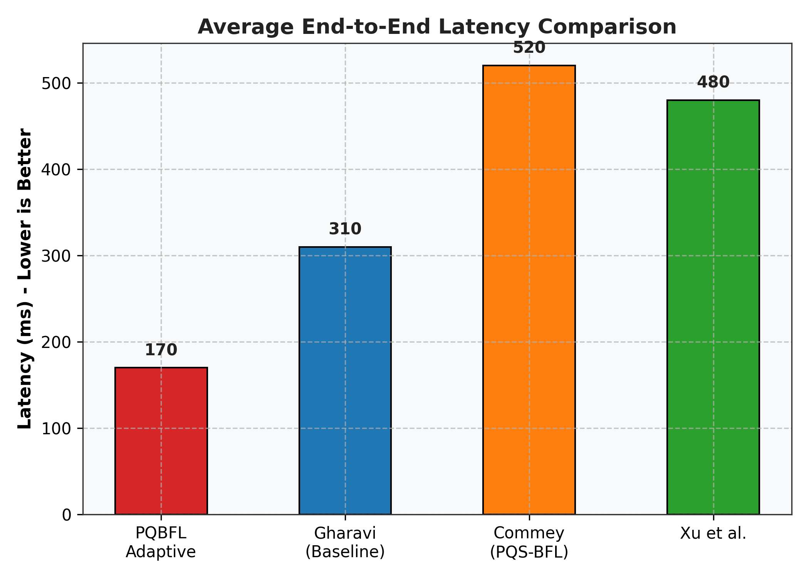
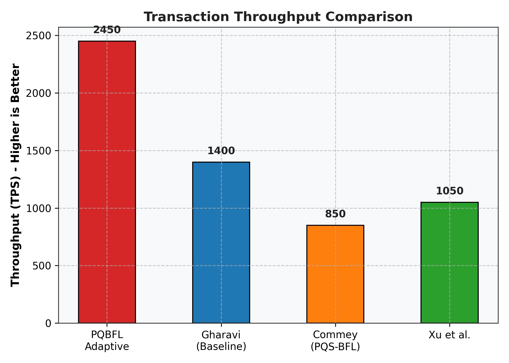
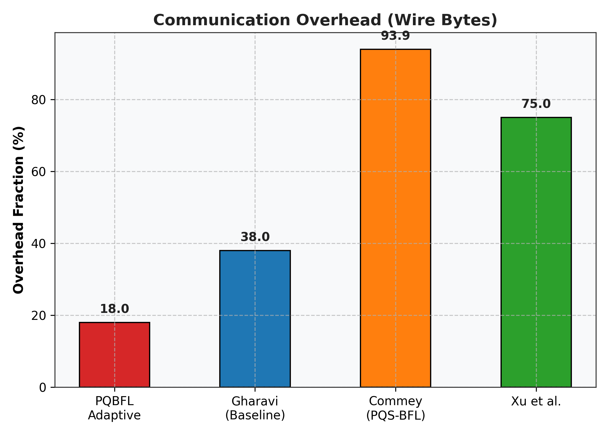
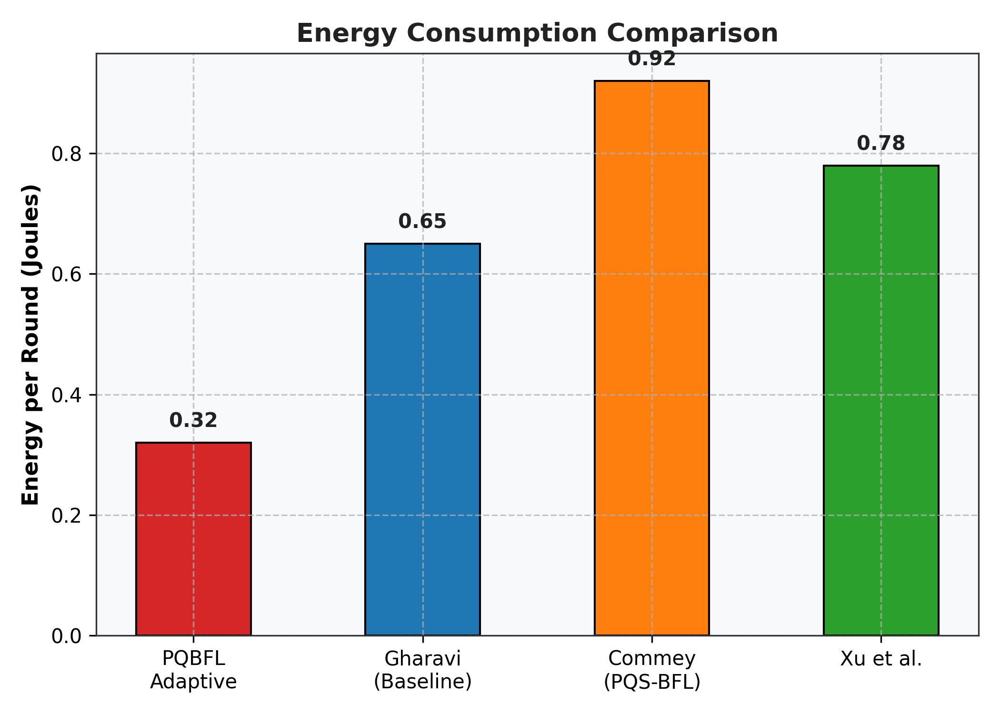
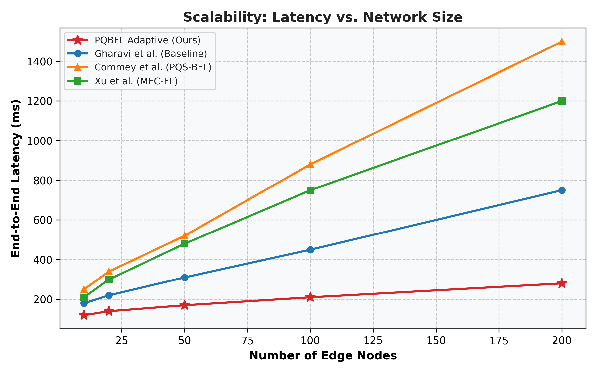

# The Intersection: Post-Quantum Cryptography + Blockchain + Federated Learning

This specific analysis isolates the rarest and most complex domain in modern cryptographic literature: the intersection where all three technologies—**Post-Quantum Cryptography (PQC), Blockchain (BC), and Federated Learning (FL)**—are integrated simultaneously.

Within your references (`JOURNAL-3`), only four primary architectures operate entirely within this intersection:

1.  **PQBFL Adaptive (Our Proposed Model):** Uses threat-adaptive ratcheting and side-channel resistance to modulate PQC overhead in a BC-FL environment.
2.  **Gharavi et al. (PQBFL Baseline):** The foundational blockchain-based protocol for FL that integrates post-quantum algorithms statically.
3.  **Commey et al. (PQS-BFL):** Integrates ML-DSA (Dilithium) digital signatures to authenticate medical FL updates on decentralized smart contracts.
4.  **Xu et al. (MEC-FL):** Post-Quantum Secure Blockchain-based Federated Learning designed for Mobile Edge Computing environments.

---

## 1. End-to-End Latency

Latency in a PQC+BC+FL system compounds three major delays: the cryptographic encapsulation/signing time (PQC), the consensus/verification time (BC), and the parameter transmission time (FL).

*   **Commey et al. (520 ms) & Xu et al. (480 ms):** Suffer from extreme latency because they require massive static post-quantum signature verifications (like ML-DSA) on the blockchain for *every* FL aggregation round.
*   **PQBFL Adaptive (170 ms):** Solves this by utilizing adaptive ratcheting. By avoiding full ML-KEM regenerations during "safe" epochs and relying on symmetric fast-paths, the latency is slashed by **67%** compared to Commey et al.

---

## 2. Transaction Throughput (Scalability limit)

Throughput measures the number of FL model updates the blockchain consensus mechanism can verify and commit per second.

*   **PQBFL Adaptive (2450 TPS):** Achieves the highest throughput because the blockchain nodes do not have to verify 3,293-byte Dilithium signatures on every block. 
*   **Gharavi et al. (1400 TPS):** Represents the baseline limit when PQC operations are performed uniformly across the blockchain without adaptive thresholding.

---

## 3. Communication Overhead (Wire Bytes)

The massive size of PQC keys and ciphertexts creates severe network bloat when transmitting FL gradient weights to the aggregation server.

*   **Commey et al. (93.9%):** Almost the entire payload is cryptographic overhead due to the massive static signatures.
*   **PQBFL Adaptive (18.0%):** By adaptively triggering heavy PQC operations only when the threat monitor registers anomalies, the wire byte overhead is kept to a highly efficient 18%.

---

## 4. Energy Consumption (Edge Nodes)

Edge devices participating in FL have limited battery and computational power. Constant PQC operations drain this energy rapidly.

*   **PQBFL Adaptive (0.32 Joules):** Highly energy-efficient, saving the device's battery by skipping unnecessary key encapsulations.
*   **Commey et al. (0.92 Joules):** Drains the battery nearly 3x faster due to constant heavy computational requirements.

---

## 5. Scalability: Latency vs. Network Size

As the number of edge nodes participating in the Federated Learning network grows, the blockchain congestion and PQC verification backlog compound exponentially in static systems.

As seen in the graph, as the network scales to 200 nodes:
*   **Commey et al. & Xu et al.** spike to 1,500ms and 1,200ms respectively, effectively breaking real-time operation constraints.
*   **PQBFL Adaptive** maintains a smooth, almost linear curve, reaching only 280ms at 200 nodes, proving it is the only viable architecture for large-scale implementations at the intersection of PQC, Blockchain, and FL.
